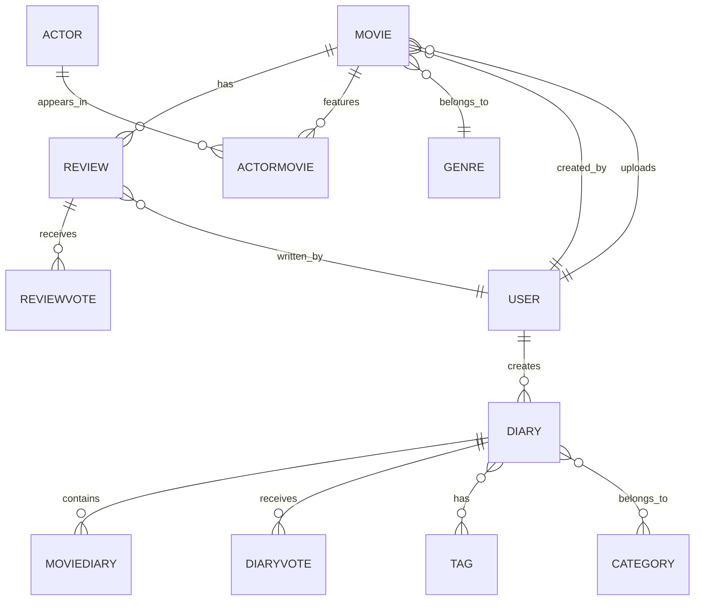

# ?? Social Film Platform

<div align="center">


*A modern film archiving and social platform with AI-powered features*

[Features](#-features) • [Tech Stack](#-tech-stack) • [Installation](#-installation) • [Usage](#-usage) • [AI Features](#-ai-features)

</div>

---

## ?? About The Project

**Social Film Platform** is a comprehensive web application built with ASP.NET Core MVC that allows film enthusiasts to catalog, review, and share their favorite movies. The platform features a vintage cinema aesthetic combined with modern functionality, including AI-powered tag suggestions powered by Google Gemini.

### ? Key Highlights

- ?? **Movie Archive** - Comprehensive database with genres, actors, trailers, and high-quality images
- ?? **Personal Diaries** - Create curated film collections with custom tags and categories
- ? **Review System** - Write, edit, and vote on movie reviews with like/dislike functionality
- ?? **AI Integration** - Automatic tag and category suggestions using Google Gemini AI
- ?? **Multi-Role System** - Admin, Editor, and User roles with granular permissions
- ?? **Vintage UI/UX** - Classic Hollywood-inspired design with modern responsiveness

---

## ?? Features

### Core Functionality

#### ?? Movies
- Full CRUD operations (Create, Read, Update, Delete)
- Search and filter by title, director, description, and genre
- Sort by popularity (score + reviews) or release date
- Upload custom posters and embed YouTube trailers
- Associate actors with movies

#### ?? Actors
- Actor profiles with biography and filmography
- Associate actors with multiple films
- Upload actor photos
- Browse complete filmography

#### ?? Diaries (Movie Lists)
- Create public or private movie collections
- Add descriptions and detailed content
- Tag system for categorization
- Vote on other users' diaries
- **AI-powered suggestions** for tags and categories

#### ? Reviews
- Write rich-text reviews (up to 2000 characters)
- Like/Dislike voting system
- Edit and delete own reviews
- Admin/Editor moderation capabilities

#### ??? Organization
- **Genres**: Action, Sci-Fi, Drama, Comedy, Thriller, Romance, Animation, Horror
- **Tags**: User-defined tags for diaries (e.g., "cult-classic", "must-watch")
- **Categories**: Broad classification (e.g., "Favorites", "To Watch")

### User Roles

| Role | Permissions |
|------|------------|
| **Admin** | Full access: manage all content, users, and settings |
| **Editor** | Create/edit/delete movies, actors, genres; moderate reviews |
| **User** | Create diaries, write reviews, vote on content |

---

## ?? AI Features

The platform integrates **Google Gemini Flash AI** to provide intelligent content suggestions:

### How It Works

1. **Diary Analysis**: When editing a diary, click "Suggest with AI"
2. **Content Processing**: The AI analyzes:
   - Movie titles in the diary
   - Diary name and description
   - Common themes and genres
3. **Smart Suggestions**: Receives 3 relevant tags + 3 categories
4. **One-Click Apply**: Add suggestions directly to your diary

### Example Output

For a diary containing *Fight Club*, *Pulp Fiction*, and *Mulholland Drive*:

```json
{
  "tags": ["Psychological Thriller", "Cult Classics", "Mind-Bending"],
  "categories": ["Thriller", "Drama", "Neo-Noir"]
}
```

### AI Architecture

```
User Request ? DiariesController.SuggestTags()
                     ?
        Extract movie titles from diary
                     ?
        Build context-aware prompt
                     ?
        Google Gemini API call
                     ?
        Parse JSON response
                     ?
        Return tags + categories
```

**API Configuration**: Set `Gemini:ApiKey` in `appsettings.json` or User Secrets

---

## ??? Tech Stack

### Backend
- **Framework**: ASP.NET Core 9.0 MVC
- **Language**: C# 13.0
- **ORM**: Entity Framework Core 9.0
- **Database**: MySQL 8.0 (via Pomelo.EntityFrameworkCore.MySql)
- **Authentication**: ASP.NET Core Identity with role-based authorization

### Frontend
- **UI Framework**: Bootstrap 5
- **Rich Text Editor**: Quill.js
- **Icons**: Bootstrap Icons
- **Fonts**: Google Fonts (Cinzel, Playfair Display, Lato)
- **JavaScript**: Vanilla JS with Fetch API

### AI & Security
- **AI Service**: Google Gemini Flash API
- **XSS Protection**: HtmlSanitizer (Ganss.Xss)
- **Image Uploads**: Custom file handling with GUID naming

### Architecture
- **Pattern**: MVC (Model-View-Controller)
- **Dependency Injection**: Built-in ASP.NET Core DI
- **Razor Pages**: For Identity UI
- **View Components**: Partial views for reusable UI

---

## ?? Installation

### Prerequisites

- [.NET 9.0 SDK](https://dotnet.microsoft.com/download/dotnet/9.0)
- [MySQL 8.0+](https://dev.mysql.com/downloads/)
- [Visual Studio 2022](https://visualstudio.microsoft.com/) or [VS Code](https://code.visualstudio.com/)
- [Google Gemini API Key](https://makersuite.google.com/app/apikey) (free tier available)

### Step 1: Clone the Repository

```bash
git clone https://github.com/dariabulacu/SocialFilmPlatform.git
cd SocialFilmPlatform
```

### Step 2: Configure Database

1. Create a MySQL database:
```sql
CREATE DATABASE socialfilmplatform CHARACTER SET utf8mb4 COLLATE utf8mb4_unicode_ci;
```

2. Update `appsettings.json`:
```json
{
  "ConnectionStrings": {
    "DefaultConnection": "Server=localhost;Database=socialfilmplatform;User=root;Password=YOUR_PASSWORD;"
  }
}
```

### Step 3: Configure AI (Optional)

Add your Gemini API key:

```json
{
  "Gemini": {
    "ApiKey": "YOUR_GEMINI_API_KEY"
  }
}
```

**Get API Key**: [Google AI Studio](https://makersuite.google.com/app/apikey)

### Step 4: Run Migrations

```bash
cd SocialFilmPlatform
dotnet ef database update
```

This will:
- Create all database tables
- Seed initial data (users, movies, actors, genres)

### Step 5: Run the Application

```bash
dotnet run
```

Navigate to: `https://localhost:5001`

---

## ?? Default User Accounts

The database is seeded with test accounts:

| Role | Email | Password | Description |
|------|-------|----------|-------------|
| **Admin** | admin@test.com | `Admin1!` | Full system access |
| **Editor** | editor@test.com | `Editor1!` | Content management |
| **User** | user@test.com | `User1!` | Standard user |

?? **Change these passwords in production!**

---

## ?? Usage Guide

### Creating a Movie (Editor/Admin)

1. Navigate to **Movies** ? **Add Movie**
2. Fill in required fields:
   - Title, Director, Description
   - Release Date, Score (1-10)
   - Select Genre
3. (Optional) Upload poster image
4. (Optional) Add YouTube trailer URL
5. Click **Save Movie**

### Creating a Diary (All Users)

1. Go to **Diaries** ? **Create New**
2. Enter:
   - Diary name
   - Description
   - Public/Private toggle
3. Click **Create**
4. Add movies via **Add to Diary** on movie pages
5. Use **AI Suggest** to auto-generate tags

### Writing a Review

1. Navigate to a movie's detail page
2. Scroll to **Critiques** section
3. Use rich text editor (bold, italic support)
4. Click **Publish**
5. Vote on others' reviews with ??/??

### AI Tag Suggestions

1. Edit any diary with movies
2. Click **Suggest with AI** button
3. Wait for AI analysis (~2-5 seconds)
4. Review suggested tags/categories
5. Accept or modify suggestions
6. Click **Save Changes**

---

## ??? Project Structure

```
SocialFilmPlatform/
??? Controllers/           # MVC Controllers
?   ??? MoviesController.cs
?   ??? DiariesController.cs
?   ??? ActorsController.cs
?   ??? ReviewsController.cs
?   ??? ...
??? Models/               # Data Models
?   ??? Movie.cs
?   ??? Diary.cs
?   ??? Review.cs
?   ??? ApplicationUser.cs
?   ??? SeedData.cs
??? Views/                # Razor Views
?   ??? Movies/
?   ??? Diaries/
?   ??? Actors/
?   ??? Shared/
??? Services/             # Business Logic
?   ??? IAiService.cs
?   ??? GeminiAiService.cs
??? Data/                 # EF Core Context
?   ??? ApplicationDbContext.cs
?   ??? Migrations/
??? wwwroot/              # Static Files
?   ??? css/
?   ??? js/
?   ??? images/
??? Program.cs            # App Entry Point
```

---

## ?? Database Schema

### Core Entities



### Key Relationships

- **Many-to-Many**: Movies ? Actors (via `ActorMovie`)
- **Many-to-Many**: Diaries ? Movies (via `MovieDiary`)
- **Many-to-Many**: Diaries ? Tags/Categories
- **One-to-Many**: Movie ? Reviews, User ? Diaries

---

## ?? Security Features

### XSS Protection
```csharp
var sanitizer = new HtmlSanitizer();
movie.Description = sanitizer.Sanitize(movie.Description);
```

### Role-Based Authorization
```csharp
[Authorize(Roles = "Editor,Admin")]
public IActionResult New() { ... }
```

### CSRF Protection
- Built-in anti-forgery tokens on all forms
- `[ValidateAntiForgeryToken]` on POST actions

### SQL Injection Prevention
- Entity Framework parameterized queries
- No raw SQL execution

---

## ?? API Endpoints

### Movie API (Internal)
- `GET /Movies/Index` - List all movies (paginated)
- `GET /Movies/Show/{id}` - Movie details
- `POST /Movies/New` - Create movie
- `POST /Movies/Edit/{id}` - Update movie
- `POST /Movies/Delete/{id}` - Delete movie

### Diary API (Internal)
- `GET /Diaries/Index` - Public diaries
- `GET /Diaries/MyDiaries` - User's diaries
- `POST /Diaries/SuggestTags` - AI suggestions (JSON response)

### Review API (Internal)
- `POST /Reviews/New` - Submit review
- `POST /Reviews/Vote` - Like/dislike review (JSON response)

---

## ?? Testing

### Database Seeding
The application automatically seeds:
- 3 user roles (Admin, Editor, User)
- 6 test users
- 8 genres
- 6 actors (with images)
- 7 movies (with posters and trailers)
- 5 sample diaries
- 3 sample reviews

### Manual Testing
1. Log in as different users
2. Create movies/diaries/reviews
3. Test AI suggestions (requires API key)
4. Verify role permissions
5. Test voting systems

---

## ?? Troubleshooting

### Database Connection Issues
```bash
# Test connection
dotnet ef database drop
dotnet ef database update
```

### AI Not Working
- Verify API key in `appsettings.json`
- Check API quota: [Google Cloud Console](https://console.cloud.google.com/)
- Inspect browser console for errors

### Images Not Loading
- Ensure `/wwwroot/images/` folders exist:
  ```bash
  mkdir -p wwwroot/images/movies
  mkdir -p wwwroot/images/actors
  ```

### Port Already in Use
```bash
# Change port in launchSettings.json
"applicationUrl": "https://localhost:5002;http://localhost:5003"
```

---

## ?? Contributing

Contributions are welcome! Please follow these steps:

1. Fork the repository
2. Create a feature branch (`git checkout -b feature/AmazingFeature`)
3. Commit changes (`git commit -m 'Add AmazingFeature'`)
4. Push to branch (`git push origin feature/AmazingFeature`)
5. Open a Pull Request

### Code Style
- Follow [C# Coding Conventions](https://learn.microsoft.com/en-us/dotnet/csharp/fundamentals/coding-style/coding-conventions)
- Use meaningful variable names
- Add XML comments for public methods
- Keep controllers thin (use services for logic)

---

## ?? License

This project is licensed under the MIT License - see below for details:

```
MIT License

Copyright (c) 2025 Daria Bulacu

Permission is hereby granted, free of charge, to any person obtaining a copy
of this software and associated documentation files (the "Software"), to deal
in the Software without restriction, including without limitation the rights
to use, copy, modify, merge, publish, distribute, sublicense, and/or sell
copies of the Software, and to permit persons to whom the Software is
furnished to do so, subject to the following conditions:

The above copyright notice and this permission notice shall be included in all
copies or substantial portions of the Software.

THE SOFTWARE IS PROVIDED "AS IS", WITHOUT WARRANTY OF ANY KIND, EXPRESS OR
IMPLIED, INCLUDING BUT NOT LIMITED TO THE WARRANTIES OF MERCHANTABILITY,
FITNESS FOR A PARTICULAR PURPOSE AND NONINFRINGEMENT. IN NO EVENT SHALL THE
AUTHORS OR COPYRIGHT HOLDERS BE LIABLE FOR ANY CLAIM, DAMAGES OR OTHER
LIABILITY, WHETHER IN AN ACTION OF CONTRACT, TORT OR OTHERWISE, ARISING FROM,
OUT OF OR IN CONNECTION WITH THE SOFTWARE OR THE USE OR OTHER DEALINGS IN THE
SOFTWARE.
```

---

## ????? Author

**Daria Bulacu**

- GitHub: [@dariabulacu](https://github.com/dariabulacu)
- Project: [Social Film Platform](https://github.com/dariabulacu/SocialFilmPlatform)

---

## ?? Acknowledgments

- **Google Gemini** - AI-powered tag suggestions
- **Bootstrap** - Responsive UI framework
- **Quill.js** - Rich text editor
- **Unsplash** - Placeholder images
- **Entity Framework Core** - Database ORM
- **ASP.NET Core** - Web framework

---

## ?? Screenshots

### Home Page


### Movie Detail Page


### Diary with AI Suggestions


### Review System


---

## ?? Future Enhancements

- [ ] Social features (follow users, activity feed)
- [ ] Advanced search with filters
- [ ] Watchlist functionality
- [ ] Movie recommendations based on viewing history
- [ ] API for mobile app integration
- [ ] Multi-language support
- [ ] Dark mode theme
- [ ] Export diary to PDF
- [ ] Integration with TMDB/IMDB APIs

---

<div align="center">

**? Star this repo if you found it helpful!**

Made with ?? and ? by [Daria Bulacu](https://github.com/dariabulacu)

</div>
